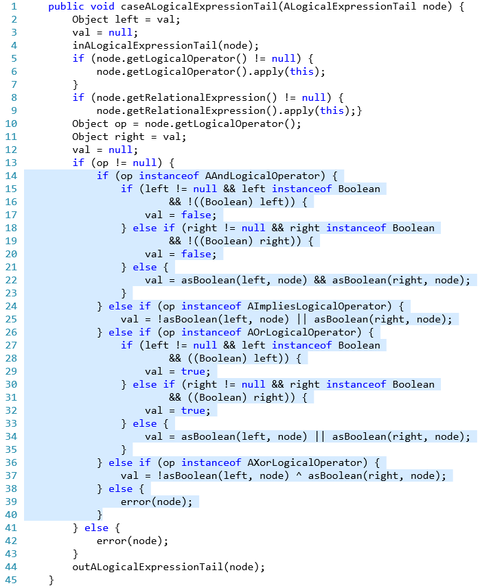
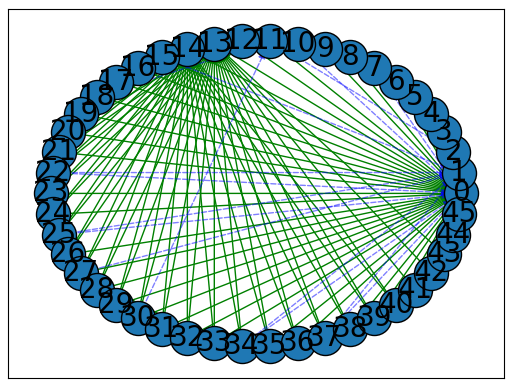

# Extract Method

*Extract Method* is a python implementation of an automated code refactoring tool for refactoring Java Long Method and Feature Envy code smells. The proposed tool aims to deal with issues related to long method detection, refactoring, selection of the proper name for the new method, and identification of the destination class. The tool mainly uses graph analysis techniques to identify and refactor Java long method smells.

## Getting started
### Install requirements
First, install the tool requirements, which are available in the requirement.txt file. Use the following command:
```bash
pip install -r requirements.pip
```

### Generate project call graph

The Extract Method refactoring tool uses the [java-callgraph](https://github.com/gousiosg/java-callgraph) utilities to generate call graphs for a given Java project.

To run Extract Method for your java project, you need to generate a file named `call.txt` and put it in the project's source code directory. The `call.txt` file is generated with the following command using [java-callgraph](https://github.com/gousiosg/java-callgraph):

```bash
java -jar javacg-0.1-SNAPSHOT-static.jar jar_file_path > project_path/call.txt
```

Replace `jar_file_path` with tha path of the project's jar file and `project_path` with your project source code path in the above command.


### Run the Extract Method tool

Put the project's source code directory in the root directory of the Extract Method tool and run the tool with the following command:

```bash
python main.py projetc_directory_name
```

Replace `projetc_directory_name` with the name of your Java project.

The execution of the tool can take a few minutes or some hours, depending on the project size. After execution, the recommended refactorings for the project will be printed out. You can save the desired outputs in a file. 


## Benchmarks
Currently, three Java projects are available in this repository as the benchmark on which our tool runs successfully:

* ArgoUML (v0.34)
* FreeMind (v0.9.0)
* JEdit

## Demo
Figure 1 demonstrates the `caseALogicalExpressionTail` method with 45 lines of code in class `org.argouml.profile.internal.ocl.EvaluateExpression` of the **ArgoUML** project. This method is detected as a long method by the proposed tool. The identified lines of code to be extracted as the new method have been highlighted in the figure. 
From line 14 to line 40 is considered to be extracted as a new method. It is observed that these lines of code are used to set the value of the field in the `EvaluateExpression` class named `val`, which is a separate responsibility compared to the rest of the method's body. 
Figure 2 shows the dependency graph of `caseALogicalExpressionTail` method used for analyzing the method during refactoring process.  



_Figure 1. Extract Method opportunity identified by the proposed approach in `org.argouml.profile.internal.ocl.EvaluateExpression` class of the ArgoUML project._



_Figure 2. Dependecy graph of method in Figure 1_


## Publications 
[1] An Automated Extract Method Refactoring Approach to Correct the Long Method Code Smell (To be published).


